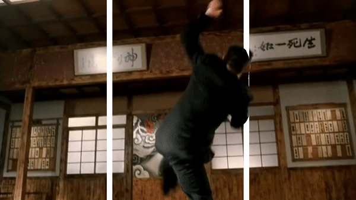

# Mask-RCNN 3D

## Introduction

|**3d gif 1**|**3d gif 2**|**3d gif 3**|
| :--: | :--: | :--: | 
||||

As shown above, by putting two parallel white lines on a moving image, we can generate a 3D (look-like) image. This project puts this idea into use by exploiting object detection and scene segmentation information generated by [Mask-RCNN](https://github.com/matterport/Mask_RCNN).

Here are some demo images:

|**Original Image 1**|**New Image 1**|**Original Image 2**|**New Image 2**|
| :--: | :--: | :--: | :--: |
|||||

|**Original Video 1**|**New Video 1**|**Original Video 2**|**New Video 2**|
| :--: | :--: | :--: | :--: |
|||||

## Usage

Before start, download the pre-trained COCO weights (mask_rcnn_coco.h5) file from the [released page](https://github.com/matterport/Mask_RCNN/releases) and put it in the main folder.

Generating 3D (look-like) image:

- `python 3d_image.py -i images/persons.jpg -o images/persons_3d.jpg`

- `python 3d_image.py -i images/persons.jpg -o images/persons_3d.jpg -w 30 -d 20`

Generating 3D (look-like) video:

- `python 3d_image.py -i images/jetlee.mp4 -o images/output.avi`

## Acknowledgments

This repository is based on [Mask-RCNN](https://github.com/matterport/Mask_RCNN) and [Mask-RCNN-Shiny](https://github.com/huuuuusy/Mask-RCNN-Shiny)

