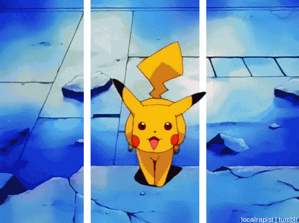
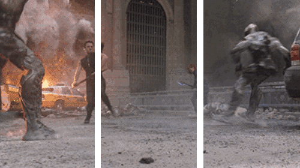
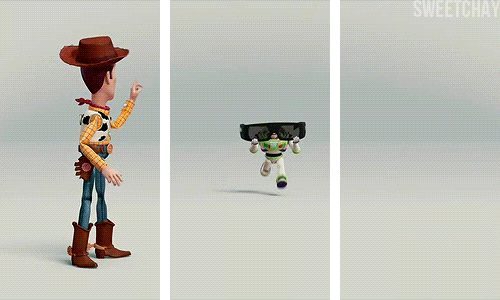
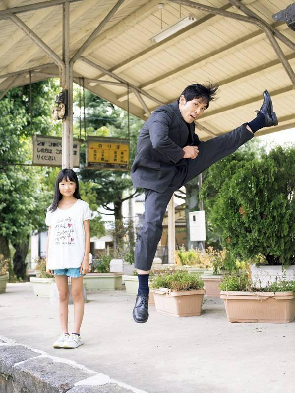
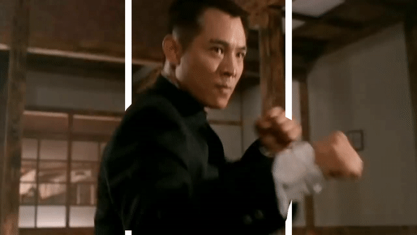

# Mask-RCNN 3D

* [English](./README.md)

## 缘起

|**3d gif 1**|**3d gif 2**|**3d gif 3**|
| :--: | :--: | :--: | 
||||

如上图所示，通过对动图或者视频添加单色竖条，会让它们产生裸眼3D的效果。通常的做法，截取每秒钟30帧的图像，然后人工识别背景和人物，用photoshop等工具，进行处理，最后加以合并，以产生预期效果。本项目，利用了[Mask-RCNN](https://github.com/matterport/Mask_RCNN)来进行目标检测和场景分割，来自动生成裸眼3D效果的视频。

效果演示:

|**原图 1**|**处理图 1**|**原图 2**|**处理图 2**|
| :--: | :--: | :--: | :--: |
|||||

|**原视频 1**|**处理视频 1**|**原视频 2**|**处理视频 2**|
| :--: | :--: | :--: | :--: |
|||||

|**原视频**|**处理视频**|
| :--: | :--: |
|||

* 看完整版视频, 请点击: [https://youtu.be/6NLvF_LcZ-4](https://youtu.be/6NLvF_LcZ-4)

## 用法

可选: 下载已经训练过的 COCO 权值文件 (mask_rcnn_coco.h5), 从 [发布页面](https://github.com/matterport/Mask_RCNN/releases) 然后放入项目主目录. (如果权值文件不存在，运行下面的程序，也会自动从github下载mask_rcnn_coco.h5)

生成 裸眼3D 图片:

- `python 3d_image.py -i images/persons.jpg -o images/persons_3d.jpg`

- `python 3d_image.py -i images/persons.jpg -o images/persons_3d.jpg -w 30 -d 20`

生成 裸眼3D 视频:

- `python main.py -i images/jetlee.mp4 -o images/output.avi`

可选的参数:

```
-i (--input): 必须, 视频文件的输入路径

-o (--output): 必须, 视频文件的输出路径

-w (--width): type=int, default=20, 竖条的宽度pixel

-d (--distance): type=int, choices=[10..40], default = 15, 竖条距离中心的百分比距离

-c (--color): choices=["white", "black"], default="black", 竖条的颜色，可选黑、白

-t (--thickness): type=int, choices=[0..20], default = 10, 视频上下横条的厚度

```

## 答谢

本项目延展自 [Mask-RCNN](https://github.com/matterport/Mask_RCNN) 和 [Mask-RCNN-Shiny](https://github.com/huuuuusy/Mask-RCNN-Shiny)

