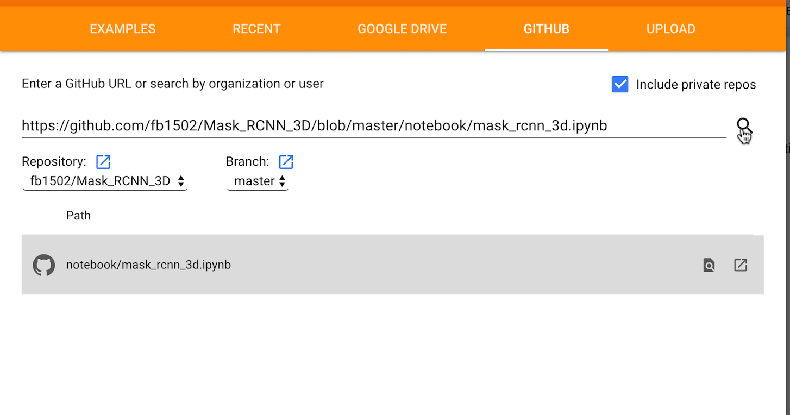
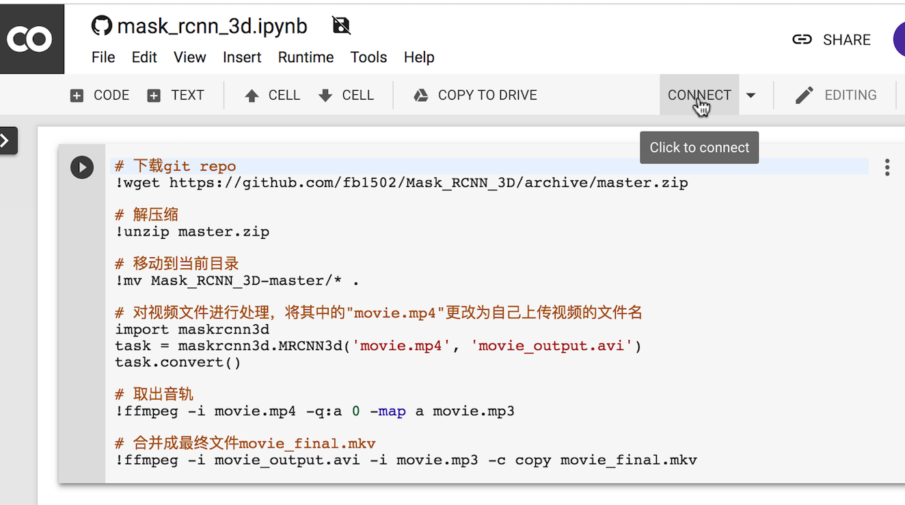
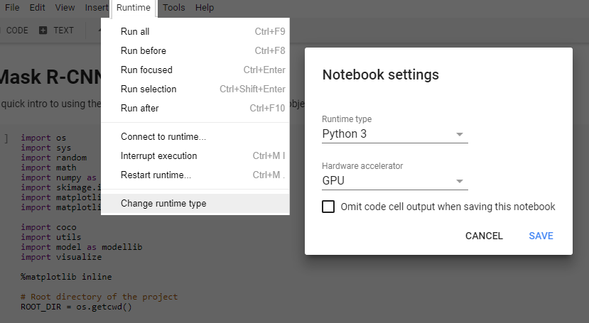
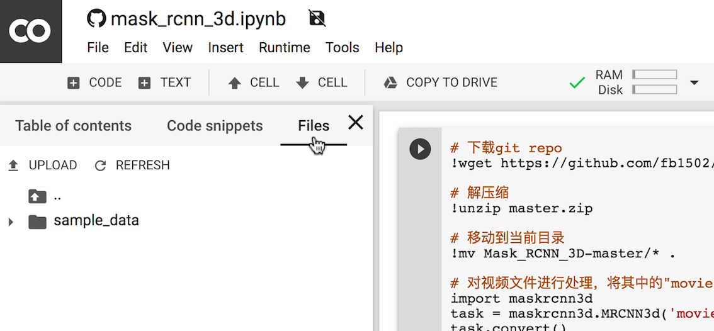
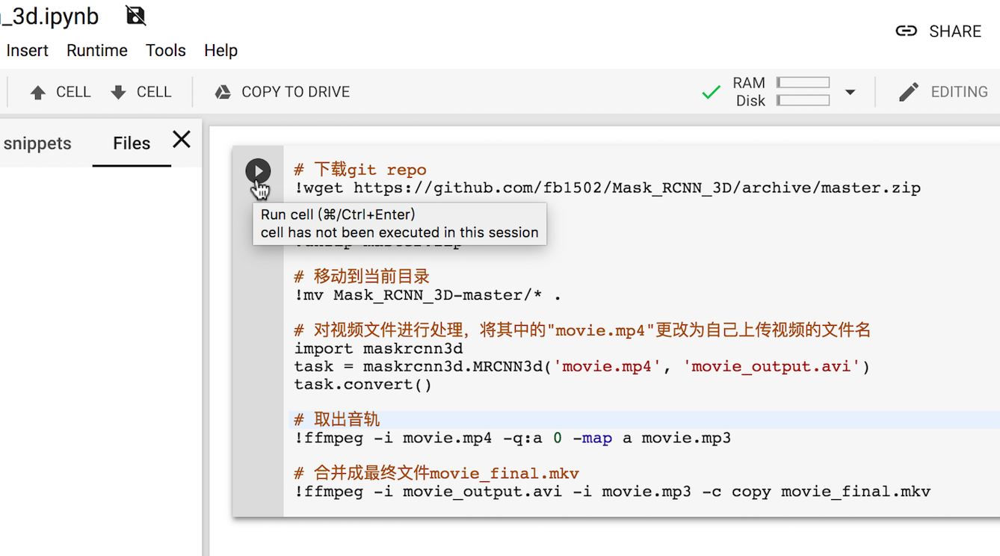

# 使用Google Colab的GPU进行视频处理

使用CPU对视频进行处理，速度较慢（2分钟的视频，需要>200分钟的处理时间）。如果本地没有GPU可以使用，可以使用Google免费提供的GPU资源，加速处理运算（2分钟视频，约需要20分钟的处理时间）。

## 步骤

* 打开Google Colab: https://colab.research.google.com/

* 如下图，选择Github，并将提供的notebook地址复制进去：https://github.com/fb1502/Mask_RCNN_3D/blob/master/notebook/mask_rcnn_3d.ipynb 

* 选择 Connect，连接服务器

* 确定 GPU 已经选上

* 点选 File，然后点选左侧的 UPLOAD，上传本机的视频文件，譬如 movie.mp4

* 将 Notebook 中的 movie.mp4 改成刚刚上传的视频文件，然后点运行按钮

* 在左侧的 File 栏中，点击 REFRESH 刷新后，右键点选新生成的视频文件(movie_final.mkv)，选择 DOWNLOAD 下载

